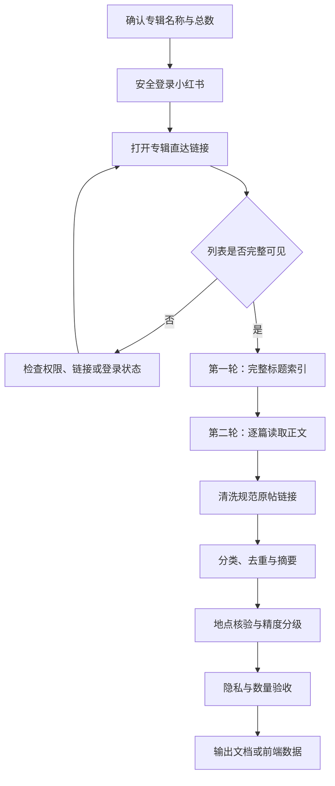

# 小红书收藏夹整理：可复用操作指南

> 适用场景：使用 ChatGPT/Codex 的云浏览器，将一个小红书收藏专辑整理为可搜索、可导航、可接入网页或旅行计划的结构化资料。<br>
> 文档版本：1.0<br>
> 示例来源：2026 年 9 月“泰国”收藏专辑整理实践，共 43 篇笔记。<br>
> 核心原则：只读操作、先建完整索引、事实与建议分开、链接不携带登录态、模糊位置不伪装成精确地址。

---

## 1. 最终交付物

一次完整整理至少应产生四类结果：

1. **原始笔记索引**：专辑中的每篇笔记都保留标题、规范原帖链接和基础分类。
2. **结构化摘要**：提取地点、价格线索、交通、营业信息、避坑提醒及使用建议。
3. **可执行收藏**：把地点型内容、实用信息和纯灵感内容分开，避免所有笔记都进入地图。
4. **质量与维护记录**：记录链接状态、位置精度、最后核验日期、待复核事项和隐私检查结果。

不要只输出一份泛泛的“推荐清单”。必须能够从整理结果追溯到每一篇原帖，也必须能证明专辑中的笔记没有被漏掉。

---

## 2. 操作边界与安全规则

开始前明确本次任务是否只读。旅行收藏整理通常采用以下边界：

- 允许：打开专辑、阅读笔记、滚动页面、查看评论中的地点线索、复制公开链接、整理摘要。
- 禁止：点赞、关注、评论、私信、修改收藏、移动笔记、删除笔记、改变专辑权限。
- 登录凭据只能通过安全登录界面输入，不在聊天中发送密码、验证码或登录二维码内容。
- 不保存手机号、邮箱、证件号、订单号、小红书账号 ID、共享成员身份等个人信息。
- 不把带登录状态、分享追踪或账号标识的链接写入文档或前端。
- 不复制整篇原文；保留事实型摘要、必要的短信息和原帖入口。

推荐在开始时明确告诉执行者：

> 以只读方式整理，不点赞、不关注、不评论、不修改收藏。只处理指定专辑，不扫描无关的全部收藏。

---

## 3. 开始前需要准备的信息

| 信息 | 是否必需 | 说明 |
|---|---:|---|
| 专辑名称 | 必需 | 例如“泰国” |
| 专辑总笔记数 | 强烈建议 | 手机端显示通常比网页端更可靠，例如 43 篇 |
| 专辑分享链接 | 强烈建议 | 从手机端专辑右上角“分享 → 复制链接”获取 |
| 整理目的 | 必需 | 旅行规划、商品研究、灵感库、知识库等 |
| 已知分类 | 可选 | 例如曼谷、普吉、交通、餐饮、实用信息 |
| 行程约束 | 可选 | 日期、城市、同行人数、明确排除项、预算等 |
| 输出形式 | 可选 | Markdown、CSV、JSON、网页数据文件 |

如果网页显示的专辑数量与手机端不一致，应以用户提供的手机端截图和专辑计数作为核对依据，不能因为网页端显示“0”就判断专辑为空。

---

## 4. 完整工作流概览



实践中不要一边读第一篇正文，一边马上做最终总结。先完成全量索引，再做内容精读，能够显著减少漏项和重复劳动。

---

## 5. 第一步：安全登录浏览器

### 5.1 推荐登录流程

1. 打开小红书网页版。
2. 若未登录，进入网站提供的扫码或手机号登录界面。
3. 通过安全接管/安全登录界面由用户本人完成扫码、手机号验证或凭据输入。
4. 登录后重新打开目标专辑链接。
5. 用可见证据确认登录成功，例如页面显示收藏内容、个人收藏入口或专辑列表。

登录成功不等于目标专辑已经打开。下一步仍需核对专辑名称和笔记总数。

### 5.2 登录失效的表现

- 分享链接突然提示加载失败。
- 原本可见的笔记列表变为空白。
- 页面重新显示扫码/手机号登录。
- 普通公开页面可见，但个人收藏或共享专辑不可见。

遇到这些情况，先重新登录，再使用最新分享链接；不要连续猜测不同 URL，也不要把加载失败误判成专辑已删除。

---

## 6. 第二步：准确进入目标收藏夹

### 6.1 优先使用专辑直达链接

从手机端执行：

1. 打开“我 → 收藏 → 目标专辑”。
2. 核对专辑标题与笔记数量。
3. 点击右上角“分享”。
4. 选择“复制链接”。
5. 将链接发送给执行者。

### 6.2 必须做的三项核对

进入页面后记录：

- `albumTitle`：专辑名称。
- `expectedCount`：手机端显示的笔记数。
- `observedCount`：网页端实际加载并去重后的笔记数。

只有三者一致或差异已解释时，才能开始正文整理。

### 6.3 最常见错误：误入“全部收藏”

网页端可能无法正确显示私密共享专辑，却能显示“全部收藏”。此时浏览器看到的内容可能很多，但并不是目标专辑。

识别信号：

- 页面收藏总数明显大于目标专辑数量。
- 出现与主题无关的日常笔记。
- 网页显示“专辑 0”，手机端却显示目标专辑有内容。
- 页面 URL 不是用户提供的专辑直达链接。

正确处理：立即停止扫描，向用户说明当前看到的是“全部收藏”，要求提供目标专辑的分享链接或录屏，不继续从无关内容中猜测目标笔记。

---

## 7. 私密、共享与公开专辑的处理

### 7.1 私密共享专辑

私密共享专辑可能只返回专辑名称和数量，不返回笔记列表。此时可采用：

- 用户将专辑临时设为公开；或
- 用户在手机端从顶部匀速录屏至底部，供执行者提取标题后再逐篇定位。

不要要求用户公开专辑中的敏感资料；若专辑包含个人信息，应优先使用录屏或用户导出的标题清单。

### 7.2 权限修改后重新生成链接

专辑从私密改为公开后，旧分享链接可能继续返回加载失败。正确流程是：

1. 等待公开状态保存完成。
2. 在手机端重新执行“分享 → 复制链接”。
3. 使用新链接重新打开。
4. 若仍失败，检查云浏览器登录是否过期。

权限已修改、旧令牌失效和登录过期可能同时发生，应逐项排查，不要只反复发送同一个旧链接。

---

## 8. 第三步：第一轮完整索引

这一轮只完成“专辑里有什么”，不急于写最终摘要。

### 8.1 加载方式

1. 从专辑顶部开始。
2. 分段向下滚动，等待懒加载完成。
3. 每段记录当前可见笔记的标题和链接标识。
4. 到底部后再次检查是否还有加载提示。
5. 按笔记 ID 去重，而不是只按标题去重。

### 8.2 每篇至少记录

| 字段 | 说明 |
|---|---|
| `index` | 专辑内顺序编号 |
| `sourceTitle` | 页面显示标题 |
| `rawUrl` | 当时打开页面的地址，仅作处理中间值 |
| `noteId` | `/explore/` 后的公开笔记 ID |
| `cityHint` | 标题能确认的城市；不能确认则留空 |
| `contentTypeHint` | 地点、攻略、交通、实用、拍照等粗分类 |
| `readStatus` | `pending` / `read` / `blocked` |

### 8.3 第一轮验收

```text
已记录数量 == 专辑显示数量
去重后的 noteId 数量 == 已记录数量
每条记录都有标题或可辨认的占位说明
```

如果专辑显示 43 篇，第一轮只能记录到 42 篇，不要进入最终总结；应重新检查懒加载、重复卡片和底部内容。

---

## 9. 第四步：逐篇读取正文

### 9.1 推荐两遍读取法

**第一遍：事实提取**

- 地点/店名的中文、英文或泰文名称。
- 城市、区域、附近地标。
- 交通方式、站点、码头、机场或上车点。
- 价格、低消、门票、加工费等数字线索。
- 营业时间、营业日、预约要求。
- 支付方式、年龄、证件、保险等规则。
- 正面推荐与明确负面体验。

**第二遍：用途判断**

- 是否适合当前行程。
- 应安排在哪一天、哪个区域。
- 是否只适合作为备选。
- 是否与其他笔记重复。
- 是否属于非地点型操作卡。
- 出发前还需核验什么。

### 9.2 视频笔记和图片文字

有些信息只出现在视频字幕、封面或图片中：

- 优先读取页面能直接显示的文字、标签、评论和地点名称。
- 画面中的价格或地址无法稳定辨认时，标记“需按原帖画面复核”。
- 不要凭模糊画面猜门店名称或坐标。
- 截图只能作为辅助证据，文字摘要仍是主要交付内容。

### 9.3 摘要写作规范

每篇摘要建议包含：

```markdown
### 原帖主题

- 事实 1：地点、价格或规则。
- 事实 2：交通、体验或注意事项。
- 事实 3：必要时补充负面体验或限制。

**本次怎么用：** 放入哪一天、与什么组合、是否只是备选。

**临行核验：** 营业状态、价格、预约、天气、地图位置等动态信息。
```

写摘要时遵守：

- 价格写成“笔记中的价格线索”，不能写成当前保证价格。
- 营业时间写明需要临行复核。
- 作者主观评价与客观事实分开。
- 不把单次体验扩大为普遍结论。
- 不因为内容有趣就强行进入行程。

---

## 10. 第五步：生成安全、稳定的原帖链接

### 10.1 规范链接格式

优先保存：

```text
https://www.xiaohongshu.com/explore/<NOTE_ID>
```

删除以下查询参数及类似追踪信息：

- `xsec_token`
- `xsec_source`
- `share_id`
- `share_channel`
- `appuid`
- `apptime`
- 其他包含账号、登录态或分享追踪的数据

示例：

```text
原始分享地址：
https://www.xiaohongshu.com/explore/xxxx?xsec_token=...&share_id=...

保存地址：
https://www.xiaohongshu.com/explore/xxxx
```

### 10.2 链接验证

逐条检查：

1. 规范地址中的笔记 ID 与当前笔记一致。
2. 打开后标题与索引标题对应。
3. URL 中不存在查询字符串。
4. 不含用户账号、手机号或会话信息。
5. 同一原帖被多个地点引用时允许复用同一个 `sourceUrl`。

### 10.3 链接状态

```text
verified        标题与笔记 ID 已核对
login_required  链接存在，但查看需要登录
unavailable     删除、转私密或暂时无法访问
replaced        使用了新资料替代，且保留替换说明
```

原帖不可访问时不要悄悄换成另一篇内容。优先保留原记录，并提供专辑入口和原帖标题作为回退搜索方式。

---

## 11. 第六步：分类、去重与合并

### 11.1 建议先区分三种内容

| 类型 | 是否进入地图 | 示例 |
|---|---:|---|
| 地点收藏 | 视位置精度而定 | 餐厅、市场、码头、景点、酒店 |
| 实用收藏 | 否 | 入境流程、打车、洗衣、保险、选船指南 |
| 灵感/知识 | 否 | 拍照动作、同行约定、综合攻略 |

### 11.2 去重规则

- 同一篇笔记介绍多个地点：保留一个原帖记录，可派生多个地点条目。
- 多篇笔记介绍同一地点：合并为一个地点，保留多个来源。
- 多篇内容高度重复：合并成一张实用卡，完整索引仍保留每篇原帖。
- 综合攻略：拆出与本次路线相关的事实，其余留在灵感库。
- 与行程冲突的内容：标记 `excluded`，不要从原始索引删除。

### 11.3 推荐分类维度

- 城市：普吉、曼谷、全泰通用、通用灵感。
- 类型：餐饮、咖啡、景点、玩乐、购物、住宿、交通、实用、备选。
- 优先级：高、中、低。
- 使用时机：出发前、抵达日、特定日期、现场、雨天/低体力。
- 状态：已核验、区域级、待核验、仅灵感、排除。

---

## 12. 第七步：地点核验与坐标精度

### 12.1 位置分级

| 状态 | 使用条件 | 地图展示 |
|---|---|---|
| `verified_name` / 已核验位置 | 店名明确，并能与公开地图 POI 对应 | 可作为导航候选 |
| `approximate` / 区域锚点 | 只能确认道路、街区、岛屿、机场或市场范围 | 必须显示“区域锚点” |
| 城市默认位置 | 只有城市和方向线索 | 仅用于聚合展示，不作为导航终点 |
| `idea_only` | 纯攻略或知识，没有地点意义 | 不生成地图点 |
| `excluded` | 与日期、路线或偏好冲突 | 不进入地图和默认列表 |

### 12.2 核验要求

- 能确认英文/泰文店名，再搜索公开地图。
- 比对城市、区域、道路和附近地标，避免同名店误匹配。
- 摊位、大排档、码头入口等动态点位通常只能标区域锚点。
- 岛屿、街区和市场中心点不能标成“精确店址”。
- 无法确认时宁可保留城市默认点，也不要制造虚假精度。

示例实践中，33 个收藏地点最终分为：12 个精确点、16 个区域锚点、5 个城市默认点。

---

## 13. 建议的数据格式

### 13.1 原始笔记

```json
{
  "noteId": "6aa76ff7000000000b00d5a2",
  "sourceTitle": "曼谷老楼里的绝美寺庙景",
  "sourceUrl": "https://www.xiaohongshu.com/explore/6aa76ff7000000000b00d5a2",
  "sourceBoardUrl": "https://www.xiaohongshu.com/board/<BOARD_ID>",
  "linkStatus": "verified",
  "readStatus": "read",
  "lastVerifiedAt": "2026-09-20"
}
```

### 13.2 地点收藏

```json
{
  "id": "mitr-street",
  "type": "place",
  "name": "Mitr Street by Ruay Mitr",
  "city": "bangkok",
  "category": "food_view",
  "tags": ["餐饮", "河景", "老城区"],
  "priority": "high",
  "mapQuery": "Mitr Street by Ruay Mitr Bangkok",
  "locationStatus": "approximate",
  "sourceTitle": "曼谷老楼里的绝美寺庙景",
  "sourceUrl": "https://www.xiaohongshu.com/explore/6aa76ff7000000000b00d5a2",
  "facts": ["Tha Tien 老城区的六层老楼", "顶层可看卧佛寺与湄南河"],
  "tripUse": "与湄南河和老城区路线组合",
  "verify": "临行确认营业、订位、楼层开放和低消"
}
```

### 13.3 实用收藏

```json
{
  "id": "practical-tdac",
  "type": "practical",
  "stage": "before_departure",
  "name": "泰国电子入境卡 TDAC",
  "sourceUrl": "https://www.xiaohongshu.com/explore/<NOTE_ID>",
  "facts": ["社交平台图解用于理解字段"],
  "tripUse": "四人分别填写并保存确认信息",
  "verify": "最终要求和入口以泰国移民局官网为准"
}
```

### 13.4 可选截图接口

若未来需要截图，只保留可选字段，不应让图片替代文字摘要：

```json
{
  "screenshot": {
    "src": "/screenshots/note-id.webp",
    "alt": "原帖关键信息截图",
    "width": 1080,
    "height": 1440,
    "capturedAt": "2026-09-20"
  }
}
```

截图前必须裁掉头像、账号 ID、IP、共享成员、消息通知等个人信息，并确认第三方托管的公开范围。

---

## 14. 质量验收清单

### 14.1 数量完整性

- [ ] 索引条数等于专辑显示数量。
- [ ] 每篇都有唯一 `noteId` 或明确的异常说明。
- [ ] 所有笔记均有 `readStatus`。
- [ ] 合并后的地点/实用卡可反向追溯到原帖。

### 14.2 链接质量

- [ ] 每个原帖链接使用 HTTPS。
- [ ] 每个链接都去除了查询参数。
- [ ] 不包含 `xsec_token`、`share_id`、`appuid` 等字段。
- [ ] 标题、笔记 ID 与打开后的内容对应。
- [ ] 不可访问的链接具有明确 `linkStatus`。

### 14.3 摘要质量

- [ ] 事实、作者评价和行程建议分开。
- [ ] 价格注明“线索/当时价格”。
- [ ] 营业时间、优惠、票价和预约要求列入临行核验。
- [ ] 未整段转载原文。
- [ ] 不把综合攻略整套照搬进日程。

### 14.4 地点质量

- [ ] 精确地点能与公开地图 POI 对应。
- [ ] 模糊地点明确显示“区域锚点”或“城市默认位置”。
- [ ] 实用收藏和灵感内容不生成地图标记。
- [ ] 地图导航与原帖跳转是两个独立入口。

### 14.5 隐私检查

- [ ] 没有手机号、邮箱、证件号、订单号和支付信息。
- [ ] 没有保存小红书账号 ID、共享成员或 IP 信息。
- [ ] 截图已裁掉账户和通知区域。
- [ ] 文档中没有会话令牌或分享追踪参数。

---

## 15. 常见故障与恢复方法

| 现象 | 可能原因 | 正确处理 |
|---|---|---|
| 手机显示 43 篇，网页显示专辑 0 | 私密共享专辑在网页端未渲染 | 使用专辑直达链接；必要时临时公开或上传滚动录屏 |
| 扫描到大量无关内容 | 误入“全部收藏” | 立即停止，重新核对专辑名称、URL 和数量 |
| 专辑公开后旧链接仍加载失败 | 旧分享令牌失效 | 公开后重新复制分享链接 |
| 新链接也加载失败 | 登录过期 | 重新安全登录，再打开最新链接 |
| 只能看到专辑名称和数量 | 网页端不返回私密列表 | 公开专辑或通过录屏建立标题索引 |
| 正文读取中浏览器断开 | 云浏览器连接重置 | 保存已完成序号，从下一条续做；不要从头重复 |
| 视频里的地址看不清 | 信息只在画面中 | 标记待核验，使用区域锚点，不猜店名或坐标 |
| 原帖链接要求登录 | 平台访问限制 | 标记 `login_required`，摘要继续可用 |
| 原帖删除或转私密 | 链接失效 | 标记 `unavailable`，保留标题和专辑回退入口 |
| 同一帖子生成多个地点 | 合集型笔记 | 多个地点复用同一 `sourceUrl`，不复制全文 |

执行长任务时建议每 10–15 篇记录一次进度，例如“已完成 16/43”，并保存已核验的笔记 ID。连接重置后按 ID 续做，比按页面位置更可靠。

---

## 16. 可直接复用的任务提示词

### 16.1 完整整理任务

```text
请以只读方式整理我提供的小红书收藏专辑：不点赞、不关注、不评论、不修改收藏。

先核对专辑名称和笔记总数，不要把“全部收藏”误认为目标专辑。分两轮执行：
1. 完整滚动专辑并建立全部笔记的标题、笔记 ID 和规范原帖链接索引；
2. 逐篇读取正文，提取地点、交通、价格线索、营业规则、避坑事项和可执行建议。

输出时：
- 保留完整原帖索引；
- 将地点收藏、实用收藏、灵感内容分开；
- 对重复内容进行合并，但不要从原始索引删除；
- 原帖链接删除全部查询参数；
- 地点按“精确地点 / 区域锚点 / 城市默认 / 不生成地图”分级；
- 价格、营业时间和优惠必须注明需要临行核验；
- 不保存账号 ID、手机号、证件号、订单号、会话令牌或分享追踪参数。

每完成一轮先报告数量核对结果，再继续下一轮。
```

### 16.2 只更新已有整理结果

```text
请基于现有收藏索引做增量更新，不要重新整理全部内容。

检查：
1. 专辑总数是否变化；
2. 是否有新增、删除或转私密笔记；
3. 原帖链接状态；
4. 地点名称、营业时间、价格、预约规则和地图位置是否变化；
5. 只更新发生变化的记录，并保留 lastVerifiedAt 和变更说明。

仍然保持只读，不修改小红书收藏。
```

---

## 17. 本次“泰国”专辑实践复盘

本次实际过程中的关键节点：

1. 首次登录后，网页端显示 89 篇“全部收藏”，但用户手机端明确显示“泰国”专辑为 43 篇。
2. 发现扫描对象错误后停止处理，改用用户从手机端复制的专辑直达链接。
3. 私密共享状态下，网页端只能读取专辑信息和 43 篇计数，无法渲染笔记列表。
4. 专辑改为公开后，旧分享链接失效；重新生成链接后又遇到登录会话过期。
5. 用户重新登录，公开专辑列表正常显示。
6. 第一轮完整提取 43 篇标题；第二轮逐篇读取正文。
7. 对视频画面中的早市、船票和餐厅信息进行补充核对。
8. 为 43 篇逐条生成无查询参数的规范原帖链接；核验过程中浏览器连接重置一次，从第 17 条续做。
9. 将结果拆分为地点收藏、实用收藏和低优先级灵感，并把重复主题合并为约 17 组可执行内容。
10. 地点进一步核验为 12 个精确点、16 个区域锚点和 5 个城市默认点。
11. 最终检查确认：完整索引为 43 篇，未包含登录令牌、分享追踪参数、手机号、证件号或订单号。

这次实践最重要的结论是：**收藏夹整理的第一目标不是“尽快推荐”，而是先建立完整、可追溯、无隐私泄露的资料底座。** 推荐、地图和行程都应该建立在这个底座之上。

---

## 18. 推荐维护周期

| 时间 | 检查内容 |
|---|---|
| 收藏整理完成后 | 数量、链接、分类、隐私和地点精度 |
| 出发前 2–4 周 | 预约、门票、交通班次、酒店区域和主要餐厅 |
| 出发前 1 周 | 营业日、价格、保险、天气取消条款和原帖状态 |
| 出发前一晚 | 次日天气、航班、码头/上车点和置顶操作卡 |
| 行程结束后 | 删除已失效信息，保留实际体验和纠错记录 |

增量维护时不要覆盖历史事实。建议保留 `lastVerifiedAt`、`linkStatus` 和简短变更说明，以便判断信息的新旧程度。
